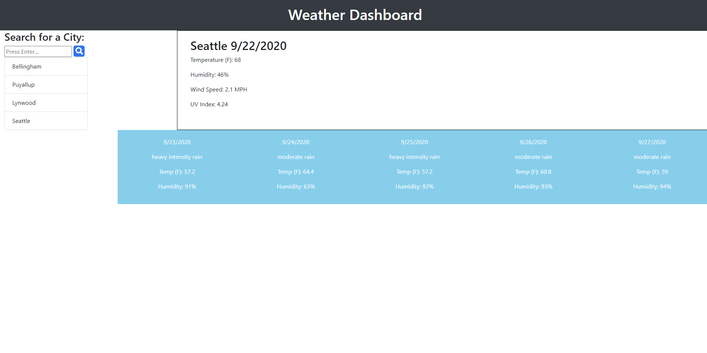

# weather-dash

This is a weather dashboard to show the current weather along with a five day forecast of a city that has been searched. It utilizes two weather api to retrieve the various weather information about a city worldwide. This application also utilizes local storage to save the information on the city that has already been retrieved. 

Retrieving the various information through the weather api was a little difficult as all the information needed was not available through a single api. Once the city weather, longitude, and latitude was retrieved from the first api, another api was used with the retrieved information to find the UV index of the particular city along with its five day forecast. The combination of two api's were enough to retrieve adequate weather information for the application. 

